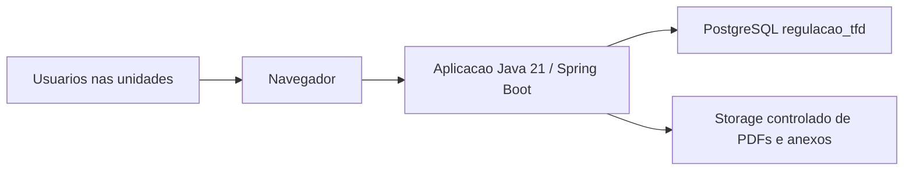

# Arquitetura TFD/APAC

## Desenho



O PostgreSQL nao deve ser exposto para as unidades. O acesso externo deve ocorrer por HTTPS e, preferencialmente, VPN. A aplicacao centraliza autenticacao, regras de permissao, registro de historico, impressao e auditoria.

## Fluxo principal

1. Solicitante cadastra ou pesquisa o paciente.
2. Solicitante abre TFD ou APAC e envia para regulacao.
3. Cada mudanca de status registra usuario, data/hora, acao e observacao.
4. Regulacao analisa, devolve, aguarda documento, autoriza ou indefere.
5. Impressao e reimpressao geram PDF e registro em `impressoes`.
6. Relatorios consultam a fila e o historico diretamente no PostgreSQL.

## Tabelas principais

- `usuarios`, `roles`, `user_roles`
- `pacientes`, `unidades_saude`, `profissionais`, `procedimentos`, `cid10`
- `solicitacoes`, `solicitacao_tfd`, `solicitacao_apac`
- `solicitacao_anexos`, `solicitacao_historico`
- `autorizacoes`, `impressoes`, `auditoria_login`

## Importacao inicial de procedimentos

O arquivo `tb_procedimento.txt` pode ser convertido em SQL de carga inicial:

```powershell
.\scripts\import-procedimentos.ps1 -Arquivo "C:\Users\joseg\Downloads\tb_procedimento.txt" -OutSql ".\procedimentos-import.sql"
```

Depois execute o SQL no PostgreSQL. Essa carga e apenas inicial; a aplicacao usa a tabela `procedimentos` como fonte oficial.
